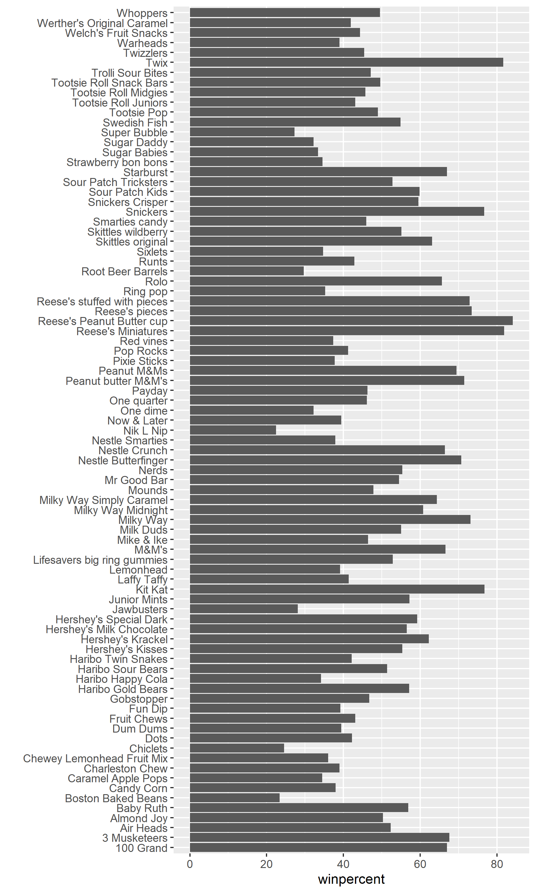

## Background

We will be using a candy data set to identify its variables needing special handling, create bar and scatter plots using `ggprel()` and `ploty()`, create correlation matrixes, and conduct and interpret PCA. In other words, we will analyze candy data with the exploratory graphics, basic statistics, correlation analysis and principal component analysis methods we have been learning thus far.

## Data Import

The data is in the form of a CSV file from 538.

```{r}
candy_file <- read.csv("candy-data.csv")
```

```{r}
candy = data.frame(candy_file, row.names=1)
head(candy)
```


> Q1. How many different candy types are in this dataset?

- There are `r nrow(candy)` rows in this data set

```{r}
nrow(candy)
```


> Q2. How many fruity candy types are in the dataset?

- There are 38 fruity candy types in the data set 

```{r}
table(candy$fruity)
```

```{r}
sum(candy$fruity)
```


Because the data set has each candy name set as the row names, we can access `winpercent` by using its name to obtain the corresponding row. 


```{r}
candy["Twix",]$winpercent
```


We can also use the `dplyr` package

```{r}
library(dplyr)
```


```{r}
  candy |> 
  filter(row.names(candy)=="Twix") |> 
  select(winpercent)
```

> Q3. What is your favorite candy in the dataset and what is it's `winpercent` value

```{r}
candy |> 
  filter(row.names(candy)=="Hershey's Milk Chocolate") |> 
  select(winpercent)
```

This can also be written in base R format as: 

```{r}
candy["Hershey's Milk Chocolate", "winpercent"]
```


> Q4. What is the `winpercent` value for "Kit Kat"?

```{r}
candy |> 
  filter(row.names(candy)=="Kit Kat") |> 
  select(winpercent)
```


> Q5. What is the `winpercent` value for "Tootsie Roll Snack Bars"?

```{r}
candy |> 
  filter(row.names(candy)=="Tootsie Roll Snack Bars") |> 
  select(winpercent)
```


We can use the `skim()` function from the skimr package to get a quick overview of the data set


```{r}
library("skimr")
```


```{r}
skim(candy)
```

> Q6. Is there any variable/column that looks to be on a different scale to the majority of the other columns in the dataset?

- The `p100` column looks to be on a different scale compared to the majority in that it's consistently in the range from 0.98 to 1, with the exception of the winpercent. 

> Q7. What do you think a zero and one represnt for the `candy$chocolate` column

- The 0 under `n_missing` means there are 0 missing values in relation to cho

```{r}
skim(candy$chocolate)
```


## Exploratory Analysis 

> Q8. Plot a histogram of `winpercent` values using both base R and ggplot2

```{r}
hist(candy$winpercent, breaks=15)
```

```{r}
library("ggplot2")
```


```{r}
ggplot(candy) +
  aes(winpercent) +
  geom_histogram(bins=15, col="darkgray", fill="lightblue")
```

For simple view of the distribution, base R is quicker

> Q9. Is the distribution of `winpercent` values symmetrical

- The distribution is not symmetrical regardless of the number of bins or breaks used

> Q10. Is the center of the distribution above or below 50%

- The center of distribution is above 50%

```{r}
mean(candy$winpercent)
```

```{r}
summary(candy$winpercent)
```


> Q11. On average, is chocolate candy higher or lower ranked than fruit candy

- Chocolate candy is higher ranked than fruit candy with a mean of 0.44

Steps
1. Find all the chocolate candy in the data set
2. Extract or find their winpercent values
3. Calculate the mean of these values
4. Find all the fruity candy in the data set
5. Find their winpercent values
6. Calculate their mean values 

```{r}
choc.candy <- candy[candy$chocolate == 1, ]
choc.win <- choc.candy$winpercent
mean(choc.candy$winpercent)
```
```{r}
fruity.candy <- candy[candy$fruity == 1, ]
fruit.win <- fruity.candy$winpercent
mean(fruity.candy$winpercent)
```


> Q12. Is this difference statistically significant

- The difference is statistically significant based on p=0.05>2.871e-08 

```{r}
t.test(choc.win, fruit.win)
```

## Overall Candy Rankings

```{r}
y <- c("z", "c", "a")
sort(y)
```

```{r}
y <- c("z", "c", "a")
order(y)

y[order(y)]
```

```{r}
sort(candy$winpercent)
```

base R: 

inds <- order(candy$winpercent)
candy[inds,]


> Q13. What are the five least liked candy types in this set

```{r}
head(candy[order(candy$winpercent),], n=5)
```

> Q14. What are the top 5 all time favorite candy types out of this set?

```{r}
tail(candy[order(candy$winpercent),], n=5)
```

> Q15. Make a first barplot of candy ranking based on `winpercent` values

```{r}
ggplot(candy) + 
  aes(winpercent,rownames(candy)) +
  geom_col() +
  ylab("")

ggsave("barplot1.png", height=10, width=6)
```





> Q16. Use the `reorder()` function to get the bars sorted by `winpercent`

```{r}
ggplot(candy) + 
  aes(winpercent,reorder(rownames(candy), winpercent)) +
  geom_col() +ylab("")
```

## Adding color 

Color by chocolate
```{r}
ggplot(candy) + 
  aes(winpercent,reorder(rownames(candy), winpercent), 
      fill=chocolate) +
  geom_col() +ylab("")
```

We don't want to make separate plots to color each variable.

We can create color vector to signify the candy types since we want custom colors

```{r}
my_cols=rep("black", nrow(candy))
my_cols[as.logical(candy$chocolate)] = "chocolate"
my_cols[as.logical(candy$bar)] = "brown"
my_cols[as.logical(candy$fruity)] = "pink"
```

Another way to write the vector 
```{r}
my_cols <- rep("black", nrow(candy))
my_cols[candy$chocolate==1] <- "chocolate"
my_cols[candy$bar==1] <-  "brown"
my_cols[candy$fruity==1] <- "pink"
```


```{r}
ggplot(candy) + 
  aes(winpercent, reorder(rownames(candy),winpercent)) +
  geom_col(fill=my_cols) + ylab("")
```

> Q17. What is the worst ranked chocolate candy?

- The worst ranked chocolate candy is Sixlets

> Q18. What is the best ranked fruity candy?

- The best ranked fruity candy is Starburst


## Taking a look at pricepercent

We can also look at the pricepercent in which lower values represent the less expensive candy and the higher values represent the more expensive candy. We can plot the pricepercent against the winpercent.

We can use the **ggrepel** package for better label placement: 

```{r}
library(ggrepel)
```


```{r}
ggplot(candy) +
  aes(winpercent, pricepercent, label=rownames(candy)) +
  geom_point(col=my_cols) + 
  geom_text_repel(col=my_cols, size=3.3, max.overlaps = 8)
```

```{r}
ord <- order(candy$pricepercent, decreasing = TRUE)
head( candy[ord,c(11,12)], n=5 )
```


> Q19. Which candy type is the highest ranked in terms of winpercent for the least money - i.e. offers the most bang for your buck?

- Tootsie Roll Midgies

```{r}
ord <- order(candy$pricepercent, decreasing = FALSE)
head( candy[ord,c(11,12)], n=5 )
```


> Q20. What are the top 5 most expensive candy types in the dataset and of these which is the least popular?

- Nik L Nip

```{r}
ord <- order(candy$pricepercent, decreasing = TRUE)
head( candy[ord,c(11,12)], n=5 )
```


## Exploring the Correlation Structure

Pearson correlation values range from -1 to +1. The values closer to 0 has significantly less correlation compared to values closer to 1. 

```{r}
library(corrplot)
```


```{r}
cij <- cor(candy)
corrplot(cij)
```

> Q22. Examining this plot what two variables are anti-correlated (i.e. have minus values)?

- Fruity and Chocolate 

> Q23. Similarly, what two variables are most positively correlated?

- Variables plotted against themselves such as chocolate to chocolate


## Principal Component Analysis 

Let’s apply PCA using the `prcomp()` function to our candy data set while remembering to set the `scale=TRUE` argument.

```{r}
pca <- prcomp(candy, scale=TRUE)
summary(pca)

```


```{r}
plot(pca$x[,2], col=my_cols, pch=16)
```

The main results figure: the PCA score plot"
```{r}
ggplot(pca$x) +
  aes(PC1, PC2, label=row.names(pca$x)) +
  geom_point(col=my_cols) +
  geom_text_repel(col=my_cols) +
  labs(title="PCA Candy Space Map",
       subtitle="Separation of Candy Type") + ylab("PC2")

```

The "loadings" plot for PC1

```{r}
ggplot(pca$rotation) + 
  aes(PC1, reorder(rownames(pca$rotation), PC1)) + 
  geom_col() + ylab("")
```
> Q24. Complete the code to generate the loadings plot above. What original variables are picked up strongly by PC1 in the positive direction? Do these make sense to you? Where did you see this relationship highlighted previously?

- High contributions to PC1 is being pluribus, hard and fruity. This makes sense because the relationships were highlighted previously in the correlation plot. These variables on the correlation plot where the characteristics of hard and pluribus were the only two with positive correlation with being fruity. SO it makes sense that all three candy characteristics are grouped together and are picked up in the positive direction. 

```{r}
my_data <- cbind(candy, pca$x[,1:3])

p <-  ggplot(my_data) + 
        aes(x=PC1, y=PC2, 
            size=winpercent/100,  
            text=rownames(my_data),
            label=rownames(my_data)) +
        geom_point(col=my_cols)
p
```

```{r}
p + geom_text_repel(size=3.3, col=my_cols, max.overlaps = 7)  + 
  theme(legend.position = "none") +
  labs(title="Halloween Candy PCA Space",
       subtitle="Colored by type: chocolate bar (dark brown), chocolate other (light brown), fruity (red), other (black)",
       caption="Data from 538")
```


## Summary

> Q25. Based on your exploratory analysis, correlation findings, and PCA results, what combination of characteristics appears to make a “winning” candy? How do these different analyses (visualization, correlation, PCA) support or complement each other in reaching this conclusion?

- Being a bar and a chocolate appears to make a "winning" candy. In the bar ggplot visualization (Q16), the most popular candies are the chocolates and those that are bars. The scatter plot visualization made in the "Taking a look at pricepercent" section shows that the chocolate candies and the bar candies have the highest win percent, further showing that those candies have a higher chance of being chosen over a random piece of candy. The correlation structure shows that if the candy is chocolate, then it a has a higher positive correlation of between 0.6 and 0.8 with being a bar candy and having high win percent. The "loadings" plot further supports that, at this point, being a chocolate candy and a bar candy makes a "winning" candy because those are the two most contributing variables to PC1. Thus, the different analyzes complement each other in reaching this conclusion by narrowing down the greater contributing factors. The visualizations give a brief overview on what actual variables, such as candy bars, are popular or stand out. The correlation plot shows how the combinations making up each variable are correlated or how they interact with each other. The PCA then narrows down which specific factors of the combination contributes greatly to the variable of interest. 
