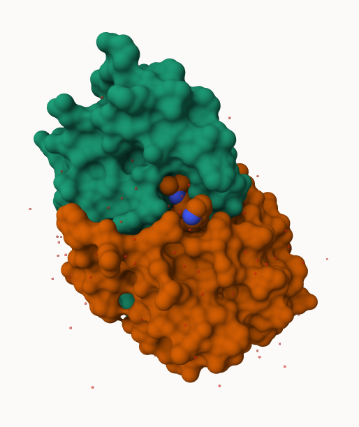
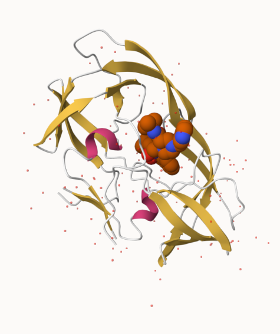
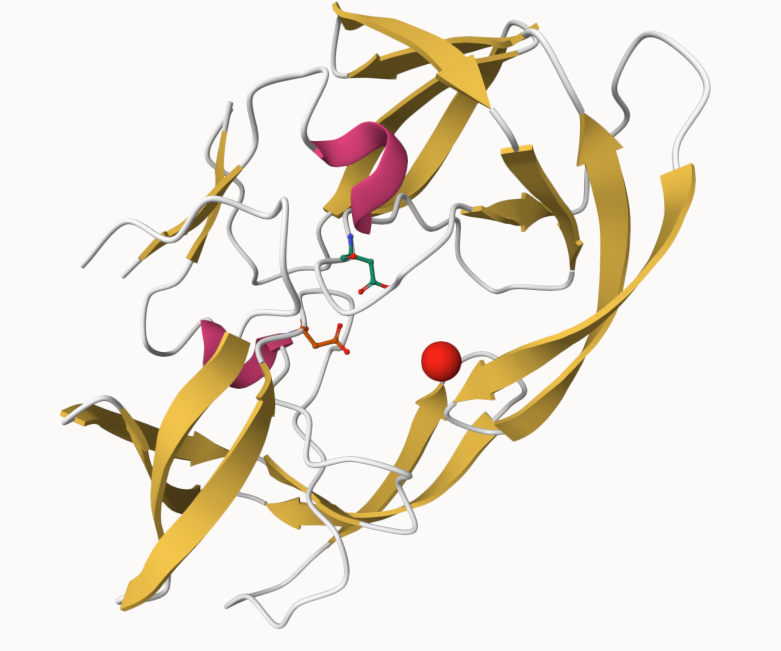

## Introduction to RCSB PDB

The [Protein Data Bank (PDB)](http:/www.rcsb.org) is the main repository of biomolecular structure data. We can use the PDB archive to understand the shape of biomolecules and understand how they work. Let's see what's in it: 


```{r}
library(readr)

protein_file <- read_csv("Data Export Summary.csv")
protein = data.frame(protein_file, row.names=1)
protein
```

> Q1. What percentage of structures in the PDB are solved by X-Ray and Electron Microscopy?

- 81% of the structure in the PDB are solved by X-ray and 13% of them are solved by Electron Microscopy


```{r}
n.sums <- colSums(protein)
n <- n.sums/n.sums["Total"]
round(n,digits=2)
```

> What is the total number of entries in the PDB

```{r}
n.sums["Total"]
```

> Q2. What proportion of structures in the PDB are protein?

- 1.72 of the structures in the PDB are protein

```{r}
r.sum <- rowSums(protein)
total <- sum(protein["Total"])
r <- r.sum/total
round(r,digits=2)
```

## Using Molestar

We can use the main [Molstar viewer online](https://molstar.org/viewer/) 

 

> Q. Generate and insert an image of the HIV-Pr cartoon colored by secondary structure, showing the inhibitor (ligand) in spacefill.



> Q. One final image showing catalytic APS 25 as ball and stick and the all-important active site water molecule as spacefill




## The Bio3D package for structural bioinformatics 

```{r}
library(bio3d)
```

```{r}
hiv <-  read.pdb("1hsg")
hiv
```

```{r}
head(hiv$atom)
```


```{r}
pdbseq(hiv)
```


### Quick viewing of PDBs

Let's try out the new **bio3dview** package that is not yet on CRAN. We can use the **remotes** package to install any R package from GitHub. 

```{r}
library(bio3dview)

sele <- atom.select(hiv, resno=25)

#view.pdb(hiv, backgroundColor = "lightblue",
#         highlight = sele,
#         highlight.style="spacefill")
```


### Prediction of Protein Dynamics (flexibility)

```{r}
adk <- read.pdb("6s36")
adk
```

```{r}
m <- nma(adk)
plot(m)
```

We can write out our results as a trajectory movie:

```{r}
mktrj(m, file="results.pdb")
```

```{r}
#view.nma(m)
```


## Comparative Protein Structure Analysis with PCA

We'll start with a data base identifier (id) "1ake_A"

```{r}
library(bio3d)

id <- "1ake_A"
aa <- get.seq(id)
```

```{r}
blast <- blast.pdb(aa)
```

Have a quick peak
```{r}
head(blast$hit.tbl)
```

```{r}
hits <- plot(blast)
```

Peak at our "top hits"
```{r}
head(hits$pdb.id)
```

Now we can download these "top hits"; these will all be ADK structures in the PDB database. 

```{r}
files <- get.pdb(hits$pdb.id, path="pdbs", split=TRUE, gzip=TRUE)
```


We need one package from BioConductor. To set this up we need to first install a package called **"BiocManager"** from CRAN. 

Now we can use the `install()` function from this package like this:
`BiocManager::install("msa")`

```{r}
pdbs <- pdbaln(files, fit=TRUE, exefile="msa")
```

Let's have a peak at our structures after "fitting" or superposing:

```{r}
library(bio3dview)

view.pdbs(pdbs)
```

```{r}
view.pdbs(pdbs, colorScheme="residue")
```

We can run functions like `rmsd()`, `rmsf()`, and the best `pca()`

```{r}
pc.xray <- pca(pdbs)
plot(pc.xray)
```

```{r}
plot(pc.xray, 1:2)
```

Finally, let's make a movie of the major "motion" or structural difference in the dataset - we call this a "trajectory"

```{r}
mktrj(pc.xray, file="results2.pdb")
```


