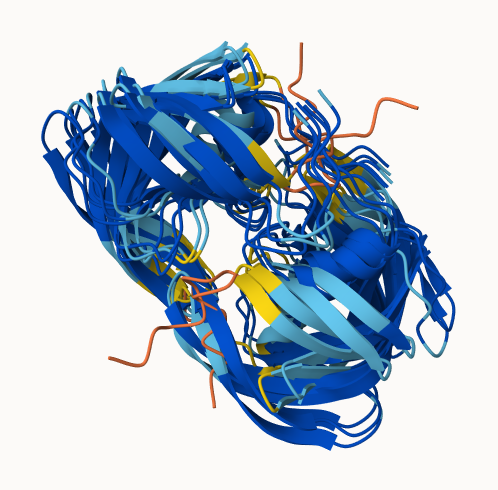
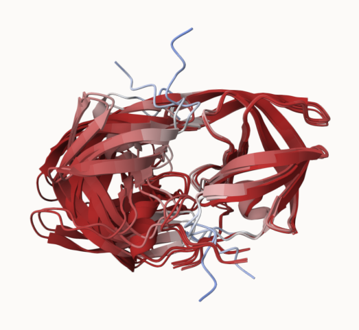

## Background 

In this hands-on session we will utilize AlphaFold to predict protein structure from sequence (Jumper et al. 2021).

Without the aid of such approaches, it can take years of expensive laboratory work to determine the structure of just one protein. With AlphaFold we can now accurately compute a typical protein structure in as little as ten minutes.

The PDB database (the main repository of experimental structures) only has **~250 thousand** structures (we saw this in the last lab). The main protein sequence database has over **200 million** sequences. Only 0.125% of known sequences have a known structure - this is called the "structure knowledge gap". 

```{r}
(250000 / 200000000) * 100
```

- Structures are much harder to determine than sequences 
- They are expensive (on average ~$1 million each)
- They take on average 3-5 years to solve 


# EBI AlphaFold Database

The EBI has a database of pre-computed AlphaFold (AF) models called AFDB. This is growing all the time and can be useful to check before running AF ourselves. 


## Running AlphaFold 

We can download and run locally (on our own computers) but we need a GPU. Or we can use "cloud" computing to run this on someone elses computer

We will use ColabFold < https://github.com/sokrypton/ColabFold >

We previously found there was no AFDB entry for our HIV sequence:

```
>HIV-Pr-Dimer
PQITLWQRPLVTIKIGGQLKEALLDTGADDTVLEEMSLPGRWKPKMIGGIGGFIKVRQYD
QILIEICGHKAIGTVLVGPTPVNIIGRNLLTQIGCTLNF:PQITLWQRPLVTIKIGGQLK
EALLDTGADDTVLEEMSLPGRWKPKMIGGIGGFIKVRQYDQILIEICGHKAIGTVLVGPT
PVNIIGRNLLTQIGCTLNF
```

Here we will use AlphaFold2_mmseqs2





## Custom Analysis of Resulting Models

```{r}
results_dir <- "hivpr_23119"
```

```{r}
pdb_files <- list.files(path=results_dir,
                        pattern="*.pdb",
                        full.names = TRUE)
```

```{r}
basename(pdb_files)
```

```{r}
library(bio3d)
pdbs <- pdbaln(pdb_files, fit=TRUE, exefile="msa")
```

Multiple Sequence Alignments of HIV-Pr

```{r}
pdbs
```


We can make a heatmap using RMSD values

```{r}
rd <- rmsd(pdbs, fit=T)
range(rd)
```

```{r}
library(pheatmap)

colnames(rd) <- paste0("m",1:5)
rownames(rd) <- paste0("m",1:5)
pheatmap(rd)
```

We can improve our superposition model of HIV-Pr by identifying the main atom positions

```{r}
core <- core.find(pdbs)
core.inds <- print(core, vol=0.5)
```

```{r}
xyz <- pdbfit(pdbs, core.inds, outpath="corefit_structures")
rf <- rmsf(xyz)

plotb3(rf, sse=pdbs)
abline(v=100, col="gray", ylab="RMSF")


```

